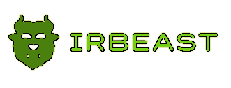

# IRBeast

IRBeast is a software tool developed to help student researchers ensure that they create a successful IRB proposal.
Use this tool to make an awesome IRB proposal document and become an IRBeast!
